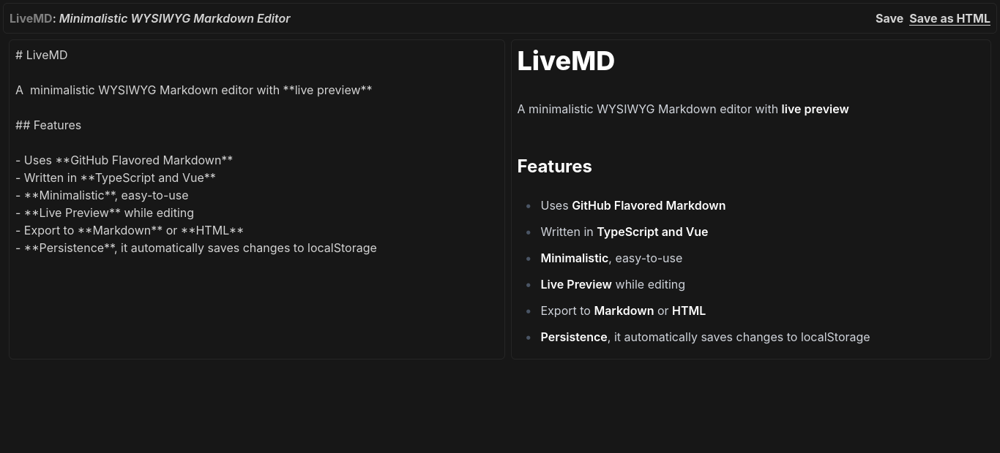

# LiveMD

A  minimalistic WYSIWYG Markdown editor with **live preview**



## Features

- Uses **GitHub Flavored Markdown**
- Written in **TypeScript and Vue**
- **Minimalistic**, easy-to-use
- **Live Preview** while editing
- Export to **Markdown** or **HTML**
- **Persistence**, it automatically saves changes to localStorage

## Demo

Try it live on [livemd.juanvel400.xyz](https://livemd.juanvel400.xyz)

## Quickstart

```sh
  # clone the repository
  git clone https://github.com/juanvel4000/livemd.git
  cd livemd
  
  # install dependencies
  npm install

  # start development server
  npm run dev

  # it should now be accessible from http://localhost:5173
```

### For Production

```sh
  npm run build
```

The build files will be available in the `dist/` directory

## Keyboard Shortcuts

| Shortcut          | Action                         |
|----------------|----------------------|
| `Ctrl+S`           |  Save as Markdown   |
| `Ctrl+Shift+S` | Save as HTML            |
| `Ctrl+B`           | **Bold text**             |
| `Ctrl+I`            | _Italic text_                  |

## Stack

- Vue 3 + TypeScript
- TailwindCSS
- [Marked](https://marked.js.org/) for Markdown parsing
- [DOMPurify](https://github.com/cure53/DOMPurify) for XSS Protection

## License

[BSD 3-Clause](https://spdx.org/licenses/BSD-3-Clause.html)
